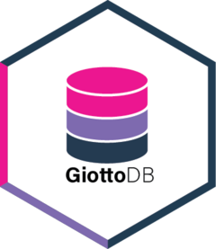

# GiottoDB  
<!-- badges: start -->
[](https://opensource.org/licenses/MIT)
[](https://www.gnu.org/licenses/gpl-3.0)
[](https://lifecycle.r-lib.org/articles/stages.html#experimental)
[](https://CRAN.R-project.org/package=GiottoDB)
[](https://bioconductor.org/)
<!-- badges: end -->

The goal of `GiottoDB` is to enable database functionality for [Giotto objects](https://drieslab.github.io/Giotto_website/) through [dbverse](https://github.com/drieslab/dbverse). 

## Installation

``` r
# install.packages("pak")
pak::pak("drieslab/GiottoDB")
```

## GiottoDB Functionality
- [x] [GiottoClass::createExprObj()](https://drieslab.github.io/GiottoClass/reference/createExprObj.html)
- [ ] [GiottoClass::createGiottoPoints()](https://drieslab.github.io/GiottoClass/reference/createGiottoPoints.html)
- [ ] [GiottoClass::createGiottoPolygon()](https://drieslab.github.io/GiottoClass/reference/createGiottoPolygon.html)
- [x] [GiottoClass::calculateOverlap()](https://drieslab.github.io/GiottoClass/reference/calculateOverlap.html)
- [x] [GiottoClass::overlapToMatrix()](https://drieslab.github.io/GiottoClass/reference/overlapToMatrix.html)
- [x] [Giotto::filterGiotto()](https://drieslab.github.io/Giotto_website/reference/filterGiotto.html)
- [x] [Giotto::normalizeGiotto()](https://drieslab.github.io/Giotto_website/reference/normalizeGiotto.html)
- [ ] [Giotto::calculateHVF()](https://drieslab.github.io/Giotto_website/reference/calculateHVF.html)
- ...
